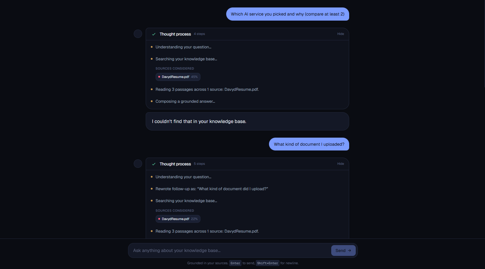
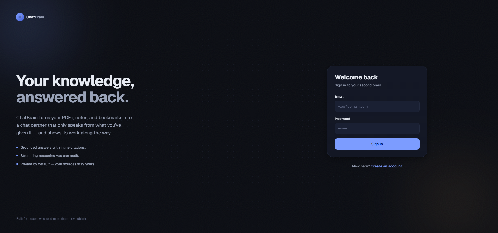
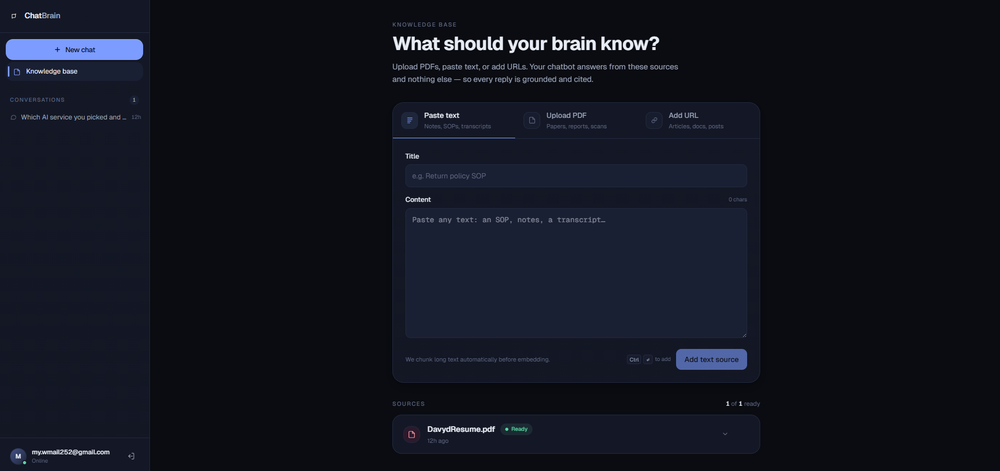

# ChatBrain

A personal "second brain" — upload PDFs, paste text, or drop in URLs; then chat
with an AI that answers strictly from your own sources and shows its reasoning
and citations in every response.

Built for the ScaleFlows developer challenge.

<p align="center">
  
</p>
<p align="center"><sub><em>Every answer shows its work — what was searched, which sources were found, and which passages produced the final claim. When the answer isn't in your sources, it says so.</em></sub></p>

- **Frontend**: Next.js 16 (App Router, React 19.2, Tailwind v4, `proxy.ts`) — talks to Supabase for auth and to the FastAPI backend for data + streaming.
- **Backend**: FastAPI (Python 3.11+) — verifies Supabase JWTs, owns ingestion and RAG, streams chat turns as Server-Sent Events.
- **Data**: Supabase Postgres with `pgvector`, Row-Level Security, and a private Storage bucket.
- **AI**: OpenAI `gpt-4o-mini` (chat + OCR) and `text-embedding-3-small` (1536-dim embeddings).

## Demo flow

1. Sign up with email + password.

    <p align="center">
      
    </p>
    <p align="center"><sub><em>The sign-in entry point. Sign-up lives one click away.</em></sub></p>

2. Open **Knowledge base**, paste a company SOP, upload a PDF manual, and add a product-page URL.
3. Watch the statuses flip from *queued* → *processing* → *ready* as the backend ingests them.

    <p align="center">
      
    </p>
    <p align="center"><sub><em>The knowledge base: add sources through any of the three tabs, then watch them flip to <strong>Ready</strong> as ingestion completes.</em></sub></p>

4. Click **New chat**. Ask *"What's our return policy for damaged items?"* — the answer cites both the SOP and the product page inline.
5. Follow up with *"And how long does the customer have?"* — the rewrite step turns the pronoun into a standalone query and the AI stays on-context.
6. Ask something off-topic like *"What's the weather in Paris?"* — it declines honestly ("I couldn't find that in your knowledge base.") instead of hallucinating.
7. Start another chat. Sign out. Sign back in. Everything's still there.

---

## Setup

### Prerequisites

- Node.js **20.9+** (Next.js 16 requirement)
- Python **3.11+**
- A Supabase project (cloud)
- An OpenAI API key

### 1. Supabase

In a new Supabase project, open the **SQL editor** and run, in order:

1. `supabase/migrations/20260421120000_init.sql` — schema, RLS, `match_chunks` RPC.
2. `supabase/migrations/20260421120100_storage.sql` — private `sources` bucket + per-user policies.

From **Project Settings → API** collect:

- Project URL → `SUPABASE_URL` / `NEXT_PUBLIC_SUPABASE_URL`
- `anon` public key → `SUPABASE_ANON_KEY` / `NEXT_PUBLIC_SUPABASE_ANON_KEY`
- `service_role` key → `SUPABASE_SERVICE_ROLE_KEY` (backend only)
- JWT secret (under *JWT Settings*, HS256) → `SUPABASE_JWT_SECRET`

For a frictionless demo you can disable email confirmation under **Authentication → Providers → Email**; otherwise users need to click the link in their inbox after signing up.

### 2. Backend

```bash
cd backend
python -m venv .venv

# Windows PowerShell
.\.venv\Scripts\Activate.ps1
# macOS / Linux
# source .venv/bin/activate

pip install -e ".[dev]"
cp .env.example .env         # fill in values
uvicorn app.main:app --reload --port 8000
```

OpenAPI docs at http://localhost:8000/docs.

Run tests:

```bash
pytest
```

### 3. Frontend

```bash
# From repo root
npm install
cp .env.local.example .env.local   # fill in values
npm run dev
```

Open http://localhost:3000.

---

## Architecture

```
Browser (Next.js 16, React 19)
 │
 ├── proxy.ts              refreshes Supabase session, redirects unauth'd
 ├── @supabase/ssr         sign-in / sign-up / sign-out via server actions
 │
 ▼
 lib/api.ts                fetch() wrapper, forwards Supabase JWT as Bearer
 │
 ▼
FastAPI (Python 3.11)
 │
 ├── /sources/{text,url,pdf}    create source, schedule ingestion
 ├── /sources (GET, DELETE)     list / remove
 ├── /conversations (CRUD)
 ├── /conversations/{id}/messages
 └── /chat/stream               SSE: thinking → tokens → citations
 │
 ├── ingestion/     chunker, embedder, pdf (PyMuPDF + vision OCR),
 │                  url (httpx + trafilatura), pipeline orchestrator
 ├── rag/           retrieval (RPC), prompts, stream orchestrator
 └── core/          settings, Supabase clients, JWT auth dep
 │
 ▼
Supabase
 ├── auth.users
 ├── public.sources / chunks (pgvector, HNSW index) / conversations / messages
 ├── match_chunks RPC (cosine similarity, user-scoped)
 └── storage.objects: `sources` bucket, {user_id}/{source_id}/file.pdf
```

**Auth model.** The browser authenticates directly with Supabase. Every call to FastAPI carries the user's access token as a Bearer; the backend verifies it with the project's JWT secret (HS256) and hands off to Supabase with either the user's token (so RLS applies to user-facing CRUD) or the service-role key (for background ingestion work, where we always pass `user_id` explicitly). RLS policies on every public table enforce `auth.uid() = user_id`, and the storage bucket policy keys off the first path segment.

**Data separation.** Each user sees only their own rows by default because:

- Every write goes through the user's JWT (RLS filter).
- The `match_chunks` RPC requires an `owner_id` argument and is only granted to `authenticated` / `service_role`.
- Storage uploads go under `{user_id}/…` and the policy checks `auth.uid()::text = (storage.foldername(name))[1]`.

---

## Which AI service and why

**Picked: OpenAI (gpt-4o-mini + text-embedding-3-small).**

I evaluated it against Anthropic Claude Haiku:

| Dimension | OpenAI (`gpt-4o-mini` + `text-embedding-3-small`) | Anthropic Claude Haiku |
|---|---|---|
| **Cost** | ~$0.15 / 1M input, $0.60 / 1M output · embeddings $0.02 / 1M | ~$0.80 / 1M input, $4 / 1M output · no first-party embeddings |
| **Embeddings** | Native, 1536-dim, batched, very cheap | None — must pair with Voyage/Cohere/OpenAI |
| **Streaming** | Standard Chat Completions SSE; low-overhead token deltas | Excellent native streaming + structured thinking blocks |
| **Vision (for OCR)** | Same model does vision; single dependency | Would need a separate vision path or keep OpenAI for OCR |
| **Follow-up rewrite** | Instruction-following is good at `temperature=0` | Claude is slightly better at this but not required |
| **Grounding discipline** | Respects a strict "only from the context" prompt well enough with temperature 0.2 | Equally strong |
| **Vendor sprawl** | 1 vendor, 1 key, 1 SDK | 2 vendors (chat + embeddings) |

**Why OpenAI won this build.** Three things mattered most for a 5-day scope:

1. **Single vendor, one SDK**: chat, streaming, embeddings, and OCR-via-vision all live behind `openai` in Python. Anthropic would mean bolting on Voyage (or OpenAI anyway) for embeddings, which doubles the surface area for keys, retries, and cost modelling.
2. **Cost**: embeddings at $0.02/1M tokens makes full-document ingestion nearly free, which matters once a user has a real knowledge base. Haiku's chat cost is ~5× OpenAI's per input token.
3. **Reasoning visibility is our own stream, not the model's.** Claude's biggest differentiator today is extended/extended-thinking blocks, but the brief asks for *app-level* reasoning ("searching sources, finding sections, forming answer") — which we design as a typed SSE stream (rewrite → retrieve → read → answer). The provider's internal thinking isn't visible to the user anyway.

Claude Haiku would be a strong runner-up if the project grew into long-context SOPs (200k-token PDFs) where Claude's context length and recall advantage start to matter.

---

## Chunking strategy

Implemented in `backend/app/ingestion/chunker.py`. The chunker is token-aware (via `tiktoken`'s `cl100k_base` encoder, matching `text-embedding-3-small`) and operates in two passes:

1. **Atomize.** Recursively split the text at the strongest available boundary:
   `\n\n` → `\n` → sentence punctuation → `;` → `,` → whitespace → token cut.
   A paragraph that fits under the target budget becomes a single atom; a paragraph that overflows is recursed on with a weaker separator.
2. **Pack.** Greedily fill a buffer up to `chunk_target_tokens` (default **800**). When the next atom would overflow, emit the current buffer as a chunk and seed the next chunk with the **tail** of the previous buffer (default **150** overlap tokens). This ensures a question whose answer spans a boundary still has local context on both sides of the cut.

**Why this over a naive fixed-size split?** A retriever trained on dense embeddings works best when every chunk is a coherent, self-contained passage. Splitting blindly at 800 tokens slices right through paragraphs, kills recall, and forces the retriever to fetch k+1 neighbours just to reconstruct a thought. The boundary-aware recurse-then-pack approach keeps paragraphs whole where possible and only resorts to harder cuts when the author gives us nothing to work with.

Chunks are stored with `chunk_index`, `token_count`, and a 1536-dim `vector` in an **HNSW** cosine index (`chunks_embedding_hnsw_idx`). HNSW vs ivfflat: HNSW doesn't need a training pass after the first rows, so cold-start retrieval is fine with a small user corpus.

Tested end-to-end in `backend/tests/test_chunker.py` against the invariants the retriever depends on (budget, overlap, contiguous indices, pathological inputs).

---

## Web scraping approach

Implemented in `backend/app/ingestion/url.py`.

1. **Fetch with `httpx`** — explicit User-Agent, 20s timeout, redirect following.
2. **Extract with `trafilatura`** — purpose-built main-content extractor that outperforms readability / BeautifulSoup heuristics at stripping navigation, ads, cookie banners, and footers. We ask for JSON output with metadata so we pull title + canonical text in one pass.
3. **Translate failures into human-readable errors.** The brief explicitly calls out the four common cases:
   - HTTP 403 → *"The site blocked our request (HTTP 403)."*
   - HTTP 401 → *"The content is behind a login (HTTP 401)."*
   - HTTP 404 → *"Page not found (HTTP 404)."*
   - Non-HTML content type → *"Unsupported content type: application/pdf"*
   - Timeout / DNS / connect → *"Request timed out."* / *"Could not reach URL: …"*
   - Extractor returns nothing or <200 chars → *"Couldn't find a readable main article — the page may be JS-rendered, paywalled, or mostly non-article content."*

Each case surfaces as the source row's `error` field and flips status to `failed`, so the user sees exactly what went wrong in the knowledge base UI.

**What we explicitly don't do** (documented below as future work):

- Headless-browser rendering for JS-only pages.
- Distinguishing "paywall" from "blocked" beyond the HTTP status.
- Recrawling on a schedule.

---

## Reasoning visibility design

The brief asks for the AI's thinking to be *inside the response itself*, not behind a spinner. The stack solves this end-to-end:

1. **Four-stage orchestrator** (`backend/app/rag/chat.py`). Every chat turn goes through explicit stages so they can be narrated:
   - **Rewrite** — if there's history, rewrite the user's message into a self-contained query (`REWRITE_SYSTEM` prompt, small LLM call at `temperature=0`).
   - **Retrieve** — embed the standalone query, call the `match_chunks` RPC scoped to the user.
   - **Read** — summarise which sources and how many chunks we picked up.
   - **Answer** — stream a grounded completion with an inline `[Sn]` citation grammar.

2. **Typed SSE events.** The streaming endpoint (`POST /chat/stream`) emits:

   ```json
   { "type": "thinking", "text": "Understanding your question…" }
   { "type": "thinking", "text": "Rewrote follow-up as: \"What is the return policy?\"" }
   { "type": "thinking", "text": "Searching your knowledge base…" }
   { "type": "sources_considered", "sources": [ { "source_id": "…", "title": "Return Policy SOP", "type": "text", "chunk_count": 3, "top_similarity": 0.87 }, … ] }
   { "type": "thinking", "text": "Reading 8 passages across 3 sources: Return Policy SOP, Product Page, Order FAQ." }
   { "type": "thinking", "text": "Composing a grounded answer…" }
   { "type": "token", "text": "We accept returns for " }
   { "type": "token", "text": "damaged items within 30 days " }
   …
   { "type": "citations", "citations": [ { "source_id": "…", "tag": "S1", "title": "Return Policy SOP", "snippet": "…" } ] }
   { "type": "done" }
   ```

3. **Frontend renders the trace inline.** `app/app/chat/[id]/chat-view.tsx` threads each event into the same React state tree:
   - Thinking lines stack in a **"Thinking" accordion** above the answer, with a spinner while streaming and a green check when done. It's collapsible but open-by-default — users can read or hide it.
   - Sources-considered events render as a row of chips with the match percentage.
   - Answer tokens stream into a bubble with a blinking caret.
   - `[Sn]` tags in the streamed text are replaced on-the-fly with small accent pills that match a **citation bar** below the answer; each citation links back to the original URL or opens the snippet on hover.

4. **Persistence.** The backend saves the reasoning trail + citations on the `messages` row in a `finally` block. A page refresh reproduces exactly what the user saw live.

5. **Grounding contract.** The `ANSWER_SYSTEM` prompt hard-codes:
   - Use **only** the provided `[S1], [S2]…` excerpts. No outside knowledge.
   - Every factual claim must cite its source tag.
   - When the answer isn't in the context, say so verbatim — don't guess.

So the user always sees **what was searched, what was found, and which passages produced the final claims** — inside the response bubble, not beside it.

---

## What I'd improve with more time

1. **Proper job queue.** Ingestion currently runs as FastAPI `BackgroundTasks`, which are good enough for a demo but die with the process. Move to `arq`/`dramatiq` on Redis (or Supabase Edge Functions + pg_cron) so long PDFs + retries survive restarts and a second worker can process in parallel.
2. **Headless-browser scraping fallback.** Many modern sites are JS-rendered. Adding a Playwright fallback for pages where trafilatura extracts <200 chars would cover most commercial sites (product pages, SPAs).
3. **Supabase Realtime for source status.** Today the `/sources` page polls every 2s while anything is pending. Subscribing to row-level changes via Realtime would be instant and cheaper.
4. **Hybrid retrieval.** Dense embeddings miss exact-match keyword queries (SKU codes, legal terms). Layering a BM25 / `pg_trgm` full-text query and fusing with RRF would noticeably lift recall on short, literal questions.
5. **Streamed chunk highlights.** When the answer cites `[S2]`, hovering the citation pill should scroll to and highlight the exact passage in the source — currently we only show a 240-char snippet tooltip.
6. **Re-ingest on source edit.** Deleting + re-adding a source works but is clumsy; add an *Edit* path that re-chunks in place.
7. **Rate-limiting + cost controls.** Per-user monthly token caps and a "cost so far" display; retry/backoff is in place on embeddings but not on chat.
8. **OCR quality.** The vision OCR fallback is fine for most scanned PDFs but falters on dense multi-column layouts. A proper local pipeline (Tesseract + `ocrmypdf`, or Mistral-OCR / Azure Document Intelligence) would improve recall on receipts and old manuals.
9. **E2E tests.** Backend has a focused pytest suite covering the invariants that actually matter (chunker, citations, URL failure modes, PDF error paths). Adding a Playwright test for the core upload → chat flow would catch regressions across the wire.
10. **Conversation export / pin / rename.** The sidebar is bare-bones; for a product this would need rename (backend already supports it), pin, search, and export-to-markdown.

---

## Project layout

```
chatbrain/
├── app/                         Next.js 16 App Router routes
│   ├── auth/actions.ts          server actions: sign-in / sign-up / sign-out
│   ├── sign-in/, sign-up/       public auth pages
│   └── app/                     protected area
│       ├── layout.tsx           server layout: auth gate + shell
│       ├── page.tsx             redirects to /app/sources
│       ├── sources/             knowledge-base management
│       └── chat/[id]/           streaming chat room
├── components/
│   ├── app-shell.tsx            sidebar + mobile drawer
│   └── brand.tsx                logo mark
├── lib/
│   ├── api.ts                   FastAPI client (Bearer + SSE reader)
│   └── supabase/                server/browser/proxy SSR clients
├── proxy.ts                     Next 16 middleware → session refresh + guard
├── backend/
│   ├── app/
│   │   ├── core/                config, logging, supabase clients, auth dep
│   │   ├── ingestion/           chunker, embedder, pdf/url/text, pipeline
│   │   ├── rag/                 retrieval, prompts, stream orchestrator
│   │   └── api/                 sources, conversations, chat routers
│   ├── tests/                   pytest
│   └── pyproject.toml
└── supabase/migrations/         schema + RLS + storage
```
